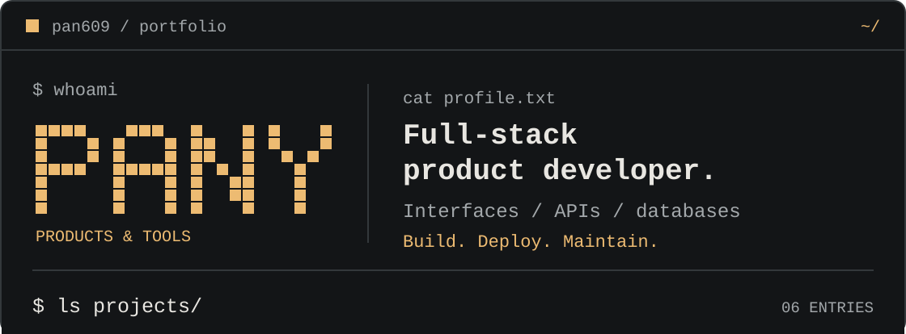
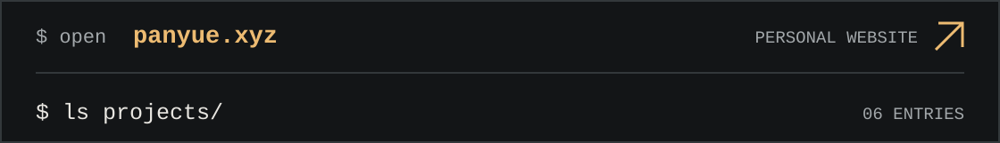
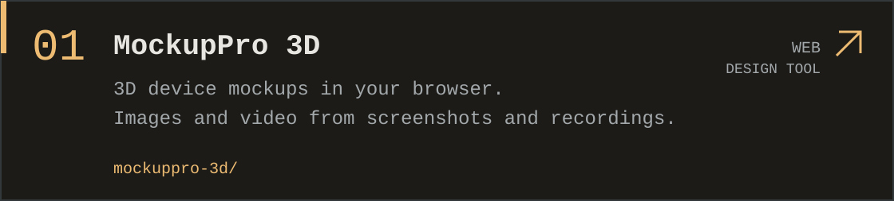
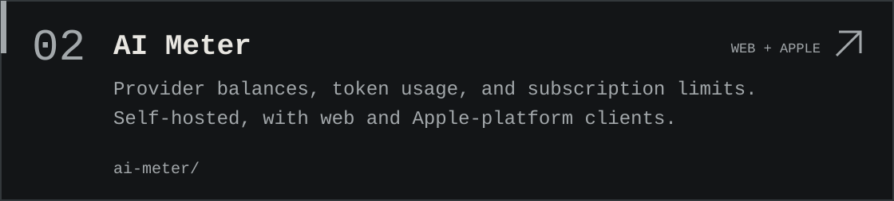
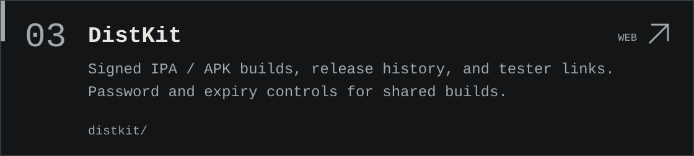
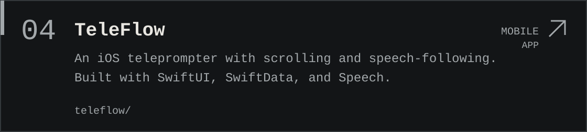
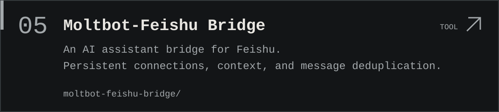
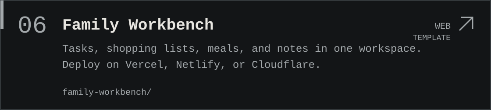
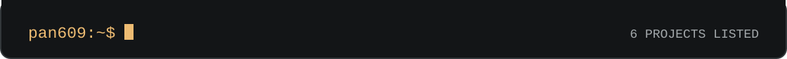

<picture><source media="(max-width: 600px)" srcset="assets/workstation/intro-mobile.svg"></picture>
<a href="https://panyue.xyz/"><picture><source media="(max-width: 600px)" srcset="assets/workstation/website-mobile.svg"></picture></a>
<a href="https://mockuppro3d.com/editor"><picture><source media="(max-width: 600px)" srcset="assets/workstation/mockuppro-mobile.svg"></picture></a>
<a href="https://github.com/pan609/token-balance-monitor"><picture><source media="(max-width: 600px)" srcset="assets/workstation/ai-meter-mobile.svg"></picture></a>
<a href="https://dist.panyue.xyz/"><picture><source media="(max-width: 600px)" srcset="assets/workstation/distkit-mobile.svg"></picture></a>
<a href="https://github.com/pan609/teleprompter"><picture><source media="(max-width: 600px)" srcset="assets/workstation/teleflow-mobile.svg"></picture></a>
<a href="https://github.com/pan609/moltbot-feishu-bridge"><picture><source media="(max-width: 600px)" srcset="assets/workstation/feishu-bridge-mobile.svg"></picture></a>
<a href="https://github.com/pan609/family-workbench-template"><picture><source media="(max-width: 600px)" srcset="assets/workstation/family-workbench-mobile.svg"></picture></a>
<picture><source media="(max-width: 600px)" srcset="assets/workstation/end-mobile.svg"></picture>

Read as text

# Pany

Full-stack product developer. I build interfaces, APIs and databases, deploy products, and maintain them.

[Personal website: panyue.xyz](https://panyue.xyz/)

### MockupPro 3D

3D device mockups in your browser. Images and video from screenshots and recordings.

Forms: WEB. DESIGN TOOL.

[Open project](https://mockuppro3d.com/editor)

### AI Meter

Provider balances, token usage, and subscription limits. Self-hosted, with native apps and an Agent Skill.

Forms: WEB, MOBILE, DESKTOP, WATCH. AGENT SKILL.

[Open project](https://github.com/pan609/token-balance-monitor)

### DistKit

Signed IPA / APK builds, release history, and tester links. Password and expiry controls for shared builds.

Forms: WEB. DEV TOOL.

[Open project](https://dist.panyue.xyz/)

### TeleFlow

An iOS teleprompter with scrolling and speech-following. Built with SwiftUI, SwiftData, and Speech.

Forms: MOBILE. APP.

[Open project](https://github.com/pan609/teleprompter)

### Moltbot-Feishu Bridge

An AI assistant bridge for Feishu. Persistent connections, context, and message deduplication.

Forms: SERVER. INTEGRATION.

[Open project](https://github.com/pan609/moltbot-feishu-bridge)

### Family Workbench

Tasks, shopping lists, meals, and notes in one workspace. Deploy on Vercel, Netlify, or Cloudflare.

Forms: WEB. TEMPLATE.

[Open project](https://github.com/pan609/family-workbench-template)

[About](https://mockuppro3d.com/about.html) · [Repositories](https://github.com/pan609?tab=repositories) · [LinkedIn](https://www.linkedin.com/in/pany-pan-785aa8183/)

